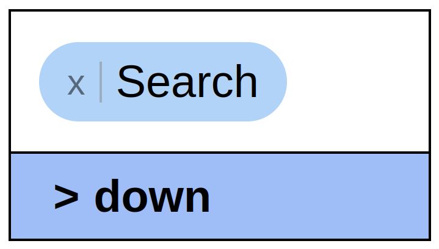

# searchdown

A lightweight JS library to provide a searchable dropdown input field.

Provides a range of options and works seamlessly with large datasets.

[Here's a demo](https://joe-herbert.github.io/searchdown/example.html)

## Usage

Download `searchdown.js` and `searchdown.css` or the minified versions.  
Add the CSS in the page `head`.

    <link rel="stylesheet" href="<path-to>searchdown.css">

Add the JS to the bottom of the page `body` (or wherever else you prefer).

    

Call `searchdown(element, options);` (must be done after including the js file). `element` can be the HTML element or an element's id, e.g.

    document.addEventListener("DOMContentLoaded", () => {
        searchdown("my-dropdown", {
            values: ["France", "England", "Spain", "Wales", "Ireland", "Germany", "Portugal", "Italy"],
            sort: "ASC",
            multiple: true,
            caseSensitive: true,
            placeholder: "Choose your item",
            inputName: "myDropdown",
        });
    });

You can access the element's value like you would with any input element, or use the function `sdGetValue(element, includeNotEntered)` to easily retrieve the value for both single and multiple inputs. `element` can be either the HTML element or the id of the element. Check the [demo](https://joe-herbert.github.io/searchdown/example.html) for an example of this being used.

## Options

The default options are:

    {
        values: [],
        sort: undefined, //allowed values: undefined (don't sort), "ASC", "DESC"
        limit: 0, //maximum number of options in the dropdown. 0 means no limit
        multiple: false, //allow user to select multiple options
        addValues: false, //allow user to add their own options
        saveEntered: addValues, //save any options the user enters into the dropdown options. defaults to true when addValues is true but always false if addValues is false
        hideEntered: false, //hide any currently selected options from the dropdown options
        allowDuplicates: false, //allow user to add an option which is already in the dropdown options
        caseSensitive: false, //show options which match the user's search by case or not
        placeholder: "Search",
        maxHeight: 600, //the maximum height of the dropdown in px
        inputName: "sd<incrementing-value>", //the value for the HTML attribute 'name' of the input
        initialValues: [], //values which should be selected initially
        simpleInput: false, //doesn't show the items in selected bubbles, just uses a standard input field. requires multiple to be false
        textarea: false, //instead of an input, use a textarea for longer text entry
        baseBackColor: "#b1d3f7",
        selectedBackColor: "#90a0c3",
        hoverBackColor: "#8ab7d9",
        baseTextColor: "#000",
        selectedTextColor: "#000",
        hoverTextColor: "#000",
    }

## Styling

The layout of a searchdown field is shown below. You can use the classes to style elements through your own custom CSS.

    div.searchdown
        div.sdInputWrapper
            div.sdEnteredWrapper
                span.sdEntered
            input.sdInput
        div.sdDropdownWrapper
            ul.sdDropdown
                li.sdOption
                li.sdAddOption //only if addValues is true

## HTML-Only Declaration

If you choose, you can avoid using JavaScript to declare your dropdowns by giving a div the class `.searchdown` and specifying the options using [data attributes](https://developer.mozilla.org/en-US/docs/Learn_web_development/Howto/Solve_HTML_problems/Use_data_attributes) preceded by the prefix `sd_`.

The only required attribute is `data-values`, which should be a string which will return an array with `JSON.parse()`.

*Note: The HTML spec says data attributes should be lowercase. e.g. `addValues` becomes `addvalues`. Searchdown will understand!*

For example:

    

If you want to disable automatically creating searchdown fields, add the following line of JS before including the searchdown JS file.

    const SEARCHDOWN_AUTO_CREATE = false;
